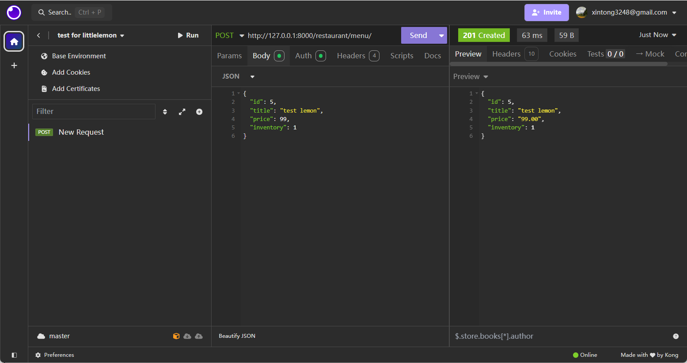

# Little Lemon Restaurant Web Application

The Little Lemon Restaurant project connects the restaurant back-end to a MySQL database. This project includes the setup of a booking system and menu display using Django REST Framework (DRF).

Features:
* Database Integration: Successfully connected the Little Lemon restaurant back-end to a MySQL database.

* Booking API: Implemented a RESTful Table Booking API to facilitate reservations. This API allows customers to book a table for dining on a specific date and for a certain number of people.

* Menu API: Developed a Menu API to display food items available for ordering. Customers can view the menu and select items to order.

**See [here](./instructions.md) for a detailed step-by-step guide to replicate this project.**

 

## Demo

**Index page:** restaurant/

**Menu items:** restaurant/menu/

**Booking endpoint:** restaurant/booking/

**Booking information:** restaurant/booking/tables

**Testing:**

* Unit test     

* Insomnia   
    * POST - add a new menu item    
    
    * GET - get menu items    
    
    * PUT - update an existing menu item    
    
    * Accessing a protected page without token    
    
    * Accessing a protected page with token    
    

## Note

This project is currently in the development stage. Two things need to be noted:
- **Environment Setup:** The repository does not contain a pre-configured environment. Users will need to create and configure their own virtual environment to manage dependencies.
- **MySQL Database:** The project uses a MySQL database configured with data that resides only on the developer's local machine. Users will need to set up their own local MySQL database and configure the connection settings in the project.

